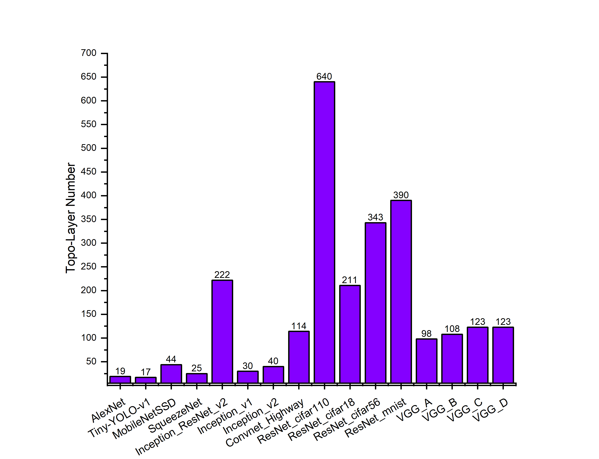

# Motivation

【图1：不同神经网络拓扑层数统计】

对比不同的神经网络，我们发现深度神经网络有一个显著的特点就是将他们转换为DAG后，他们的拓扑层数十分多。图1呈现了不同神经网络的拓扑层数统计。AlexNet，Tiny-YOLO-v1，MobileNetSSD，SqueezeNet，Inception等都是一些比较小的深度神经网络，平均层数都在15层-50层左右。但Inception_ResNet_v2因为加入了残差网络，所以层数会有222层。不同的ResNet、VGG层数均比较多，VGG平均在100层左右，ResNet均超过了200层，ResNet_cifar110的层数最多，有640层。而未统计的其他残差网络具有更深的层数，最多可达到千层。

神经网络深层数的特点对调度方案延迟长度，并行数都有着一定的影响，如何合理的分配处理器的个数是我们需要解决的一个重要问题之一。

# Algorithm

考虑到深层数的DAG在不同的PE个数上的调度方案有着很大的区别，若PE个数小，则周期长度短，调度方案的重定时值大；反之，PE个数大，周期长度长，调度方案的重定时值小。因为总延迟是和周期长度与重定时值的乘积有关，并且PE个数和多发射次数以互为反比关系，所以如何平衡的选择PE个数是一个十分关键的问题。

上述算法利用贪心的思想选择不同PE个数的调度方案，并组合在一起得到最小的总延迟时间。算法的输入包括：PE个数$N_{PE}$，$N_{PE}$种调度方案（因为在本步骤中不再进行微观的调度调整，而是从宏观上来分配组合不同的调度方案，所以对每个调度方案只需要记录调度方案需要的PE个数$Schi_i.h$，Prolouge长度$Sch_i.c_{prologue}$，周期长度$Sch_i.c_p$，周期图重复次数$Sch_i.X_p$），图总共需要运行的次数$X$。算法最后输出分配的调度组合方案，并且包括了每个调度方案的发射次数，执行图的次数。

算法的3-15行根据贪心策略生成了一个调度方案的组合，16-22行根据调度方案的组合分配每个调度方案需要执行图的次数。对于指定的图运行次数，算法首先假设仅仅采用一种调度的策略，计算出所需要的总延迟$Sch_i.c$。从中选出具有最小总延迟的调度，初始化该调度的延迟为其前序时间，图执行次数为0（8行），多发射次数为当前能执行的最大多发射次数（9行），最后加入队列$Q$。根据剩余的PE个数$h$，重新计算各个调度的总延迟，并重新选择调度，直至PE个数为0。因为存在所需的PE个数为1的调度，所以一定能够完全分配。分配执行轮数的部分也是利用贪心的思想，每次为总时间延迟最少的一个调度分配一组执行轮数，这样最终的总延迟一定少于单独采用这些调度的总延迟。
