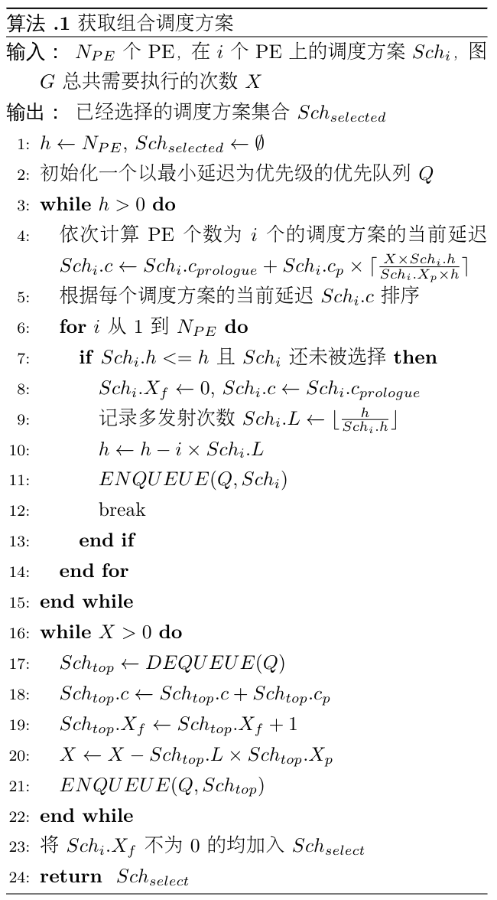

# DNN

In order to learn the kind of complicated functions that can represent high-level abstractions (e.g. in vision, language, and other AI-level tasks), one needs deep architectures. [LDA]

A deep neural network (DNN) is an artificial neural network with multiple layers between the input and output layers. [Wiki-DNN]

Deep convolutional neural networks have led to a series of breakthroughs for image classification. [DRL],[ImageNet with DCNN]

the network depth is of crucial importance, and the leading results on the challenging ImageNet dataset all exploit “very deep” models, with a depth of sixteen to thirty. [DRL] 

GoogLeNet是一个22层的深度网络，它的理念是没有最深，只有更深。它增加了网络的宽度和深度，在分类和检测任务上均取得了不错的效果。GoogLeNet采用了Inception的概念，利用网中网（Network in Network）的结构[NIN]，将原来的每个节点都用一个网络来表示，使得整个网络结构的深度更深，更能挖掘出更有特点的属性。[GoogLeNet]

Deep Residual Network(Deep ResNet)也是一个深度网络，现在最深可以达到千层。它主要是为了解决在网络加深后，准确度快速退化的问题。（with the network depth increasing, accuracy gets saturated (which might be unsurprising) and then degrades rapidly.）[DRL]

# Motivation

深层神经网络同样可以被抽象成一个有向无环图。它相比于一般的神经网络，不同之处在于它具有更长的拓扑结构。通过比较，常见的一般网络层数不深，如LeNet仅有5层，AlexNet仅有8层，VGG有19层等，而深度神经网络的层数会比这些网络多上好几倍，如ResNet最初提出时就已经达到了152层[DRL]，现在更是发展到了上千层。

对于这些深度神经网络的训练或预测过程是比较缓慢的，有些网络虽然在提出时就考虑到了计算性能的问题，但由于网络的深度及宽度，仍然需要耗费很多的计算资源。

# Algorithm

上述算法利用贪心的思想选择不同的调度组合得到最小的总延迟时间。算法执行前按照上文中的“生成初始调度+调整调度”的策略生成了$h​$种调度方案，分别对应了PE个数为1到$h​$。因为深度网络的层数较深，能够用于填补传输时间的节点更多，所以当PE个数越大时，调度方案每个周期的时间逐渐减短，前序时间逐渐降低。但每个调度需要的PE个数越多，它能进行的多发射次数则越少。如何选择一个合理的组合方式使得总延迟最短是本算法的核心问题。

算法的2-14行根据贪心策略生成了一个调度方案的组合，15-21行根据调度方案的组合分配每个调度方案需要执行的轮数，获得最小延迟。对于指定的图运行轮数，算法假设仅仅采用一种调度的策略，计算出所需要的总延迟$S_i.l$。从中选出具有最小总延迟的调度，初始化该调度的延迟为前序时间，执行轮数为0，多发射次数为当前能执行的最大多发射次数，最后加入队列$Q$。根据剩余的PE个数，重新计算各个调度的总延迟，并重新选择调度，直至PE个数为0。因为存在所需的PE个数为1的调度，所以一定能够完整分配。分配执行轮数的部分也是利用贪心的思想，每次为总时间延迟最少的一个调度分配一组执行轮数，这样最终的总延迟一定少于单独采用这些调度的总延迟。

# Reference

1. [LDA] Learning Deep Architectures for AI
2. [Wiki-DNN] https://en.wikipedia.org/wiki/Deep_learning#Deep_neural_networks
3. [DRL] He, Kaiming, et al. "Deep Residual Learning for Image Recognition."*computer vision and pattern recognition* (2016): 770-778.
4. [ImageNet with DCNN] Krizhevsky A, Sutskever I, Hinton G E, et al. ImageNet Classification with Deep Convolutional Neural Networks[C]. neural information processing systems, 2012: 1097-1105.
5. [GoogLeNet] Szegedy C, Liu W, Jia Y, et al. Going deeper with convolutions[J]. computer vision and pattern recognition, 2015: 1-9.
6. [NIN] Min Lin, Qiang Chen, and Shuicheng Yan. Network in network. CoRR, abs/1312.4400, 2013

