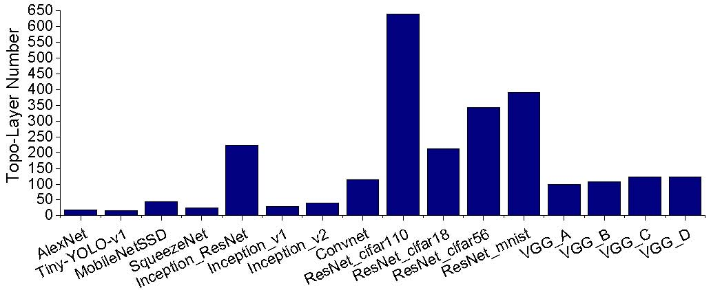

# Motivation

【图1：不同神经网络拓扑层数统计】

对比不同的神经网络，我们发现深度神经网络有一个显著的特点就是将他们转换为DAG后，他们的拓扑层数十分多。图1呈现了不同神经网络的拓扑层数统计。AlexNet，Tiny-YOLO-v1，MobileNetSSD，SqueezeNet，Inception等都是一些比较小的深度神经网络，平均层数都在15层-50层左右。但Inception_ResNet_v2因为加入了残差网络，所以层数会有222层。不同的ResNet、VGG层数均比较多，VGG平均在100层左右，ResNet均超过了200层，ResNet_cifar110的层数最多，有640层。而未统计的其他残差网络具有更深的层数，最多可达到千层。

神经网络深层数的特点对调度方案延迟长度，并行数都有着一定的影响，如何合理的分配处理器的个数是我们需要解决的一个重要问题之一。

# Algorithm

考虑到深层数的DAG在不同的PE个数上的调度方案有着很大的区别，若PE个数小，则周期长度短，调度方案的重定时值大；反之，PE个数大，周期长度长，调度方案的重定时值小。因为总延迟是和周期长度与重定时值的乘积有关，并且PE个数和多发射次数以互为反比关系，所以如何平衡的选择PE个数是一个十分关键的问题。

上述算法利用贪心的思想选择不同PE个数的调度方案，并组合在一起得到最小的总延迟时间。算法的输入包括：PE个数$N_{PE}$，$N_{PE}$种调度方案（因为在本步骤中不再进行微观的调度调整，而是从宏观上来分配组合不同的调度方案，所以对每个调度方案只需要记录调度方案需要的PE个数$Schi_i.h$，Prolouge长度$Sch_i.c_{prologue}$，周期长度$Sch_i.c_p$，周期图重复次数$Sch_i.X_p$），图总共需要运行的次数$X$。算法最后输出分配的调度组合方案，并且包括了每个调度方案的发射次数，执行图的次数。

算法的3-15行根据贪心策略生成了一个调度方案的组合，16-22行根据调度方案的组合分配每个调度方案需要执行图的次数。对于指定的图运行次数，算法首先假设仅仅采用一种调度的策略，计算出所需要的总延迟$Sch_i.c$。从中选出具有最小总延迟的调度，初始化该调度的延迟为其前序时间，图执行次数为0（8行），多发射次数为当前能执行的最大多发射次数（9行），最后加入队列$Q$。根据剩余的PE个数$h$，重新计算各个调度的总延迟，并重新选择调度，直至PE个数为0。因为存在所需的PE个数为1的调度，所以一定能够完全分配。分配执行轮数的部分也是利用贪心的思想，每次为总时间延迟最少的一个调度分配一组执行轮数，这样最终的总延迟一定少于单独采用这些调度的总延迟。

# 实验结果分析

## Processing Latency（表）

从实验结果来看，EXTENSION相比Mobile-I在16核、32核和64核上分别能够平均减少4.48%、8.33%和14.31%的时间延迟，相比Memolution在16核、32核和64核上分别能够平均减少30.74%、42.25%和54.42%的时间延迟。从趋势上看，随着核数的增长，时间延迟减少比例的越多，相比Mobile-I和Memolution，平均分别有4.91%和11.84%的减少比例的增长。在针对那些深层数的网络的调度时，如GooLeNet_Oxflowers17，ResNet_mnist，VGG的一系列网络等，EXTENSION均有显著的提升效果。这个主要原因是EXTENSION合理的组合不同的PE个数的调度方案，从而达到最短的时间延迟。

Memolution采用重定时机制来重新调动多个任务，尽管它能够有效地减少时间延迟，但是不同任务之间的时间差异使得调度方案产生的时间延迟减少量逐渐变少。Mobile-I考虑到不同任务之间的时间差异，尽可能减少了这种差异所带来的额外代价。但是Mobile-I没有考虑到深层数网络的在不同PE个数上的调度差异，而只是采用了naive的分配方案，所以在深层数网络的调度时，这种差异所带来的不足被放大，从而时间延迟高于我们的算法。

## Extra Latency for Pre-processing（图）

实验表明，EXTENSION能够显著减少Prologue的时间，相比于Memolution，平均仅是它的5.82%，比Mobile-I相比Memolution减少了8.21%。

Prologue的减少能够显著的提高整体的时间延迟。Mobile-I虽然捕获了神经网络中不同任务之间的时间差异的特性，并优先调度关键任务，但是它依旧没有解决深层数的特点所带来的长Prologue的问题。通过实验可以发现，对于深层次的网络，适当改变每次发射的PE个数能够有效的降低Prologue的长度。而EXTENSION通过一种贪心的策略，选择了当前最佳的几种调度方案组合在一起，从而整体降低了Prologue的长度。

## Cache Efficiency（表）

EXTENSION将时间延迟少和Prologue少的调度组合在一起，同时这些调度方案也都是memory-efficient。表？，呈现中间处理结果被分配到片上存储空间的个数。从实验结果来看，EXTENSION相比Mobile-I在32核和64核上分别能够平均分配1.87倍和2.42倍数量的中间处理结果个数，相比Memolution在32核和64核上分别能够平均分配3.92倍和4.33倍数量的中间处理结果个数，相比SPARTA在32核和64核上分别能够平均分配2.12倍和2.89倍数量的中间处理结果个数。从趋势上看，随着核数的增长，EXTENSION分配到片上存储空间的中间处理结果的个数越多，且增长趋势更快。这个主要原因是当核数越多的时候，EXTENSION对不同PE个数的组合方案越多，不同组合方案之间的差异逐渐变大，而EXTENSION能够从这些组合方案中选取最佳的方案。

SPARTA没有采取重定时技术，故同一个时间段需要分配到片上存储空间的中间处理结果个数很少，甚至都可以被安排到片上存储空间，但SPARTA的时间延迟特别高。Memolution使用了重定时技术，并且使用了动态规划的方法来进行分配中间处理结果，但是同一个时间段需要分配到片上存储空间的中间处理结果个数过多，从而导致总分配数低于其他方法。Mobile-I和EXTENSION均合理的调整了同一个时间段需要分配到片上存储空间的中间处理结果个数，但Mobile-I使用了贪心的方法，EXTENSION使用了动态规划的方法，所以EXTENSION能够得到更佳的结果。

## Utilization Ratio of PEs（图）

图？展示了EXTENSION，Mobile-I，Memolution和SPARTA的PE的利用率。EXTENSION平均能够取得最高的利用率97.26%，Mobile-I、Memolution和SPARTA分别平均取得88.58%、56.19%和39.30%的利用率。

SPARTA在同一个周期内维护了数据的以来关系，所以它无法用将其他的任务覆盖任务之间传输时产生的空隙，从而导致低利用率。Memolution结合重定时技术提高了利用率，但不同任务之间的时间差异对Memolution的调度方案造成了一定影响。Mobile-I虽然设计了针对关键任务的调度方案，但未能解决深层数的特性。

## Time Cost for Preprocessing（表）

EXTENSION和Mobile-I都需要对中间处理结果存储在片上存储空间还是DRAM进行分配。表？展示了EXTENSION和Mobile-I实际算法执行的时间长度，单位为毫秒。从结果来看，EXTENSION算法需要花费更长的时间来得到调度方案。这主要的原因是Mobile-I采用了贪心的策略，而EXTENSION采用了动态规划的方法，同时EXTENSION需要获取多个不同PE的调度方案，这些都会导致EXTENSION算法花费更多的时间。Mobile-I所采用的贪心算法的时间复杂度为$O(nlog_n)$，而EXTENSION中的算法所需要的时间复杂度是$O(k\times n^2)$，其中$n$为中间结果的个数，$k$为不同PE的调度方案的个数。

