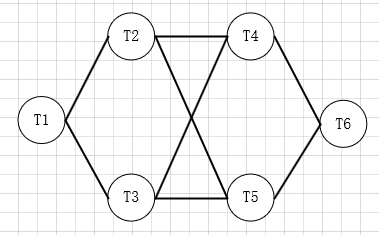
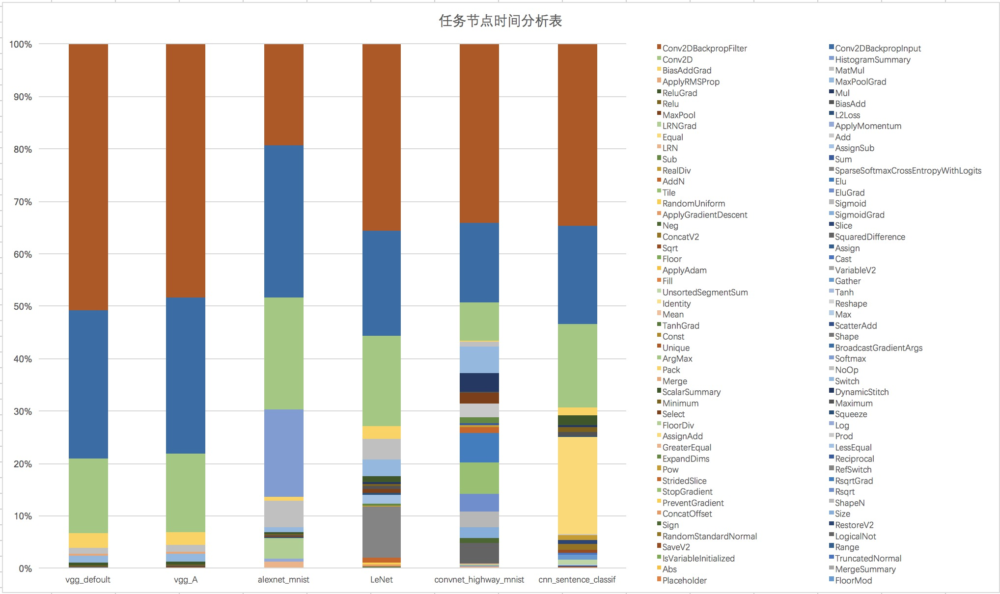
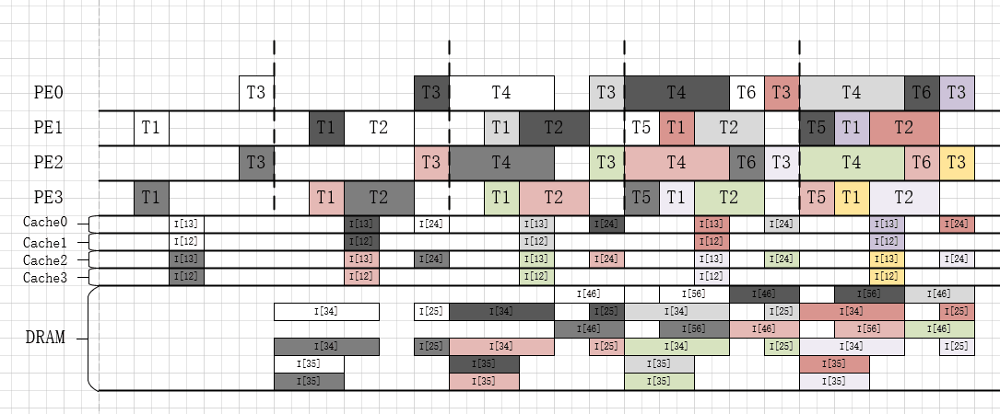
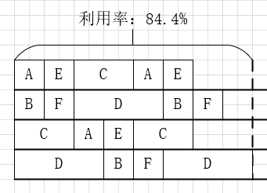
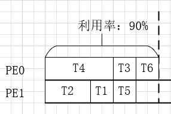
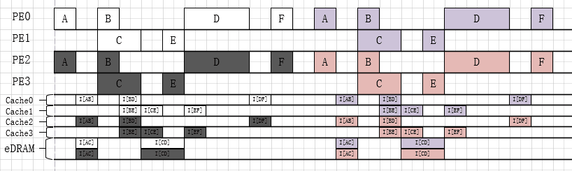

# 背景

##TensorFlow

TensorFlow是现在最流行的一个机器学习框架之一，它使用数据流图来描述数学计算。在数据流图中，节点一般表示数学运算，也可以表示数据输入的起点或输出的终点；边表示在这些节点之间传递的张量。

## CNN

## 硬件架构

随着计算效率在由神经驱动的学习系统（neuro-inspired learning systems）中被施以强烈的关注，基于神经形态（neuromorphic）的高级加速架构越来越多，其中最经典的就是基于HMC的Neurocube。HMC由多个堆叠在一起的DRAM Die和一个单独的逻辑层组成。如图左侧，每个DRAM Die被划分成16份子块，从垂直方向看对应的子块构成一个Vault，每个Vault在逻辑层上对应一个Vault控制器。Neurocube在HMC的基础上对逻辑层进行了改变，将Vault控制器、可编程的神经序列生成器（PNG）、路由器（Router）、执行单元（PE）组合在一起，构成新的逻辑层。如图右侧，路由器通过2D全连接NoC网络连接在一起；每个执行单元内包括了一个Cache、一个权值Buffer、一个缓冲Buffer、一个操作计数器和多个乘法累加器。

数据可以被存储Vault（DRAM）和Cache之 中。DRAM能够存储的数据远大于Cache，但读取的速度却慢了很多，所以**在存储数据的时候需要判断是存储在Vault之中还是存储在Cache之中**。PNG负责控制数据的流动，当计算开始时，PNG根据当前神经元所需要的数据去对应的存储位置取到数据，然后封装成对应的数据包，通过NoC网络传送给对应的PE进行计算。当PE中MAC计算完成后，将计算完成的结果传回给PNG，PNG判断后继需要这个数据的神经元，将其存储到对应PE的Cache之中，若Cache存储不下，则存储到对应的vault中。

# 建模

在TensorFlow中，神经网络可以通过TensorBoard来展现数据的流动状况，如下图。TensorBoard 通过读取 TensorFlow 的事件文件来运行。TensorFlow 的事件文件包括了在 TensorFlow 运行中涉及到的运算操作。

如果我们把TensorBoard的图中最小的框（直接与数据边相连的）作为节点，把数据流动作为边，再去除一些无关紧要的节点后，我们就可以把这个数据流图抽象建模成一个有向无环图。

# 动机

CNN的高准确率和适用性促进了许多AI应用的诞生，如DeepFace，Prisma（<u>*参考的李涛教授的论文*</u>）。它们在实际应用中十分广泛，也得到了人们的广泛亲睐。这些AI应用都是基于已经训练好的CNN模型，直接对未知的新样本进行预测。越来越多的人使用AI应用，这对它们的实际预测性能提出了很高的要求：耗时短、准确率高等。在某一个较短的时间内，提供AI服务的服务端需要同时对大量的新样本进行预测，若预测的速度不够快将会增加用户的等待时长。本文基于此提出一个合理的调度算法，能够根据现有的资源给出一个调度方案，在一个可接受的时间范围内，让总体的时间降低，提高单位时间内的现有资源的利用率。

以上面的有向无环图为例，以下展示了一种在4个PE上的调度策略。

这种调度策略使用了2次发射，每次发射上，每隔9个单位时间为一个周期。

通过对从TensorFlow得到的有向无环图的数据进行分析，可以得到以下分析图。

从数据分析图中可以看出，其中有3类节点的运行时间都普遍较长：Conv2DBackproFilter类的节点在vgg图中平均占据了约50%的运行时间，在LeNet、convnet和cnn等图中平均占据了约35%的运行时间，在alexnet中也占据了约20%的运行时间；Conv2DBackpropInput类的节点在vgg、alexnet等图中平均占据了约30%的运行时间，在LeNet、convnet和cnn等图中平均占据了约15%的运行时间；Conv2D类的节点在每个图平均占据了10%-15%的运行时间。同时，在alexnet图中的HistogramSummary类的节点、LeNet图中的SparseSoftmaxCrossEntropyWithLogits类节点和CNN图中的Equal类的节点也都平均占据了各自的约10%-15%的运行时间。

我们把这些时间运行长的节点称为关键节点，并针对这些关键节点专门设计了新的调度策略。

这种新的调度策略同样采用了多发射的技术，以2个PE为一次发射。每次发射也由一个个周期组成，每个周期需要5个单位时间，在调度中仅仅消耗了2个周期作为前序。这种新的调度策略相比于前者，更为紧凑，PE的利用率更高，相同的时间内执行的CNN图的次数更多。

不同任务之间的数据并不是一产生就可以直接被拿来利用计算的，往往或大多数时间都需要先存在SRAM或DRAM中，再从它们中取出来计算。我们都知道SRAM读写速度快，但容量小，DRAM速度慢，但容量大。所以在这里就存在一个选择的问题，对CNN中的每个中间结果数据都需要考虑是否放在SRAM中还是DRAM中。

# 算法

## 输入

**定义：**有向无环图DAG，$G=(V,E,P,R)$，其中$V$表示节点集合，$V=\{T_1, \ldots, T_n\}$；$E$表示边集合，$，E\subseteq V\times V$，$(T_i, T_j)\in E$，其中$T_i,T_j\in V$，边个数是$m$；$N_{PE}$表示PE个数；$R$表示图$G$的重定时次数。其中$T^l_i(s^l_i, c^l_i, d^l_i, e^l_i,tp^l_i)$表示第$l$次循环的第$i$个节点的开始时间$s^l_i$，执行时间$c^l_i$，结束时间$d^l_i$，所在PE$e^l_i$，拓扑序$tp^l_i$。$I^l_{i,j}(s^l_{i,j}, c^l_{i,j}, d^l_{i,j})$表示第$l$次循环节点$T_i$到$T_j$的边的开始时间$s^l_{i,j}$，内存消耗$c^l_{i,j}$，结束时间$d^l_{i,j}$。

**定义：**$p$表示图$G$需要循环的次数。

## 输出

* 图$G$循环$p$次所需要的总时间$T$ 

## 流程

## 细节

**定义1（周期Period）：**图$G$中节点集合$V$重复一定次数并行的在一定数量的PE上执行的过程。

**定义2（发射Launch）：**多个在相同的PE上的周期组成的集合。

**定义3（周期利用率$U_L$）：**$U_{L}=\displaystyle\frac{p_{L}\times \displaystyle\sum_{V_{i}\in V}c_{i}}{h\times t_L}$，其中$t_L$表示周期的最大时间消耗，$c_{i}$表示任务节点$T_{i}$的执行时间。

### 1. 计算每次发射的PE数$h$、图的执行次数$p_L$

因为采用了多发射技术，所以可以图$G$总的需要的循环次数均摊到每次发射之上，以达到更高效的并行性。同时每次发射所需要的PE的数量不同，对最后的结果也会有所影响。设$h$为每次发射时需要的PE数，那么$h$应该尽可能的接近图$G$的最大并发度，总共需要的发射次数$H=\lceil N_{PE}/h\rceil$。

> 设图的最大并发度为$h_{G}$。
>
> 若$N_{PE}\% h_G==0$，
>
> * $h=h_G$
> * $p_{L}=\lceil I/H\rceil$
>
> 若$N_{PE}\%h_G\neq0$，
>
> * $\begin{cases}h=h_G&Previous\;H-1\;Launchs\\h=N_{PE}\%h_G&Last\;one\;Launch\end{cases}$
> * 若设前$H-1$次发射每次循环$p_{x}$次，最后一次发射循环$p_{y}$次。故$(p_{x},p_{y})$需要满足$p=(H-1)\times p_{x}+p_{y}$。对所有满足的$(p_{x}, p_{y})$选取使总时间$T$最小的一组$(p_{x},p_{y})$。

### 2. 生成周期的任务排列

对于一个包含$h$个PE的周期，不同的任务排列对最终的结果有着很大的影响。若直接按照顺序把所有任务节点依次排列在4个PE上，可以一个周期的时长是？个单位时间，利用率是？？。通过观察可以发现，因为图G中有一个长节点$T_4$，它的运行时间远大于其他的运行节点，它对周期的时长和利用率起到了决定性作用。

为了避免分配的不均衡，本算法考虑这些长执行时间的任务节点所带来的影响，采取贪心的策略对任务节点进行排列。这个问题可以抽象成最小化最大值问题，即最小化PE上所有任务时间之和的最大值。算法的思想是对所有的节点按照执行时间大小从大到小排序，每次将枚举的节点放在当前所有PE中总时间最小的PE上。

$p_{L}$的值依据$U_{L}$来确定。每按照上述算法排列一次图$G$，$p_{L}\leftarrow p_{L}+1$，并重新计算一下当前的利用率$U$，若$U\ge U_{L}$，则停止排列；若$p_{L}\ge p_{limited}$，则停止排列，选择之前计算得到的最大的$U_{L}$。

> **Input**
>
> $A\;set\;tasks\;\{T_1,\ldots,T_n\}\in V$
>
> $N_{PE}\;homogeneous\;PEs$
>
> $h\;of\;tasks\;that\;are\;concureently\;execeuted\;within\;same\;layer$
>
> $the\;threshold\;PE's\;utilization\;ratio\;U_l$
>
> $the\;max\;repeat\;times\;p_l\;of\;tasks\;in\;same\;iteration$
>
> **Output**
>
> $An\;initial\;schedule\;with\;p_{per}\;repeat\;times\;tasks$
>
> **Content**
>
> $InitArrange()$
>
> $Sort(V) \;first\; by \;c_i\;,second\; by\; tp_{i}$
>
> $While\; U_{L}\lt U_{limited}\;and\;p_{L}\lt p_{limited}:$
>
> $\quad For\;each \;task\;T_j\in V:$
>
> $\quad\quad Assign\;T_j\;to \;a\;PE\;in\;PIM\;with\;the\;earliest\;available\;time$
>
> $\quad p_{L}\leftarrow p_{L}+1$
>
> $\quad Calculate\;U$
>
> $If\;p_{L}==p_{limited}:$
>
> $\quad Choose\;p_{L}\;with\;max\;U_{L}$
>
> $Rearrange\;p_{L}\;times\;tasks\;with\;same\;strategy$

时间复杂度：$O(p_{L}\times n\times logh)$

### Step Three：判断是否需要Retiming

**定义：**$T_{nor}$是按照上图排列所需要花费的总时间；$T_{est}$是当前算法的估计时间。

若$T_{est}\gt T_{nor}$，则按照上图排列。

计算$T_{est}$：固定步骤二中的$p_{per}$为1，计算得出前序时间$Pre_{est}$和周期时间$ub_{est}$。则$T_{est}\leftarrow Pre_{est}+p\times ub_{est}$

### Step Four：从关键节点开始向前扩散，确定周期内节点的位置

考虑到图$G$中有一些执行时间远大于其他的任务节点，他们在PE上的排列将影响整个图$G$的重定时次数$R$，所以需要先确定他们的位置。

利用第四步所获取的关键节点集合$S_{Key}$，对其中的节点来确定其前继和后继节点的位置。当$S_{Key}$为空后，从未访问的节点集合$S_{UC}$中再次获取关键节点集合。

>**Input**
>
>$A\;set\;of\;n\;tasks\;\{T_1, \ldots,T_n\}\in V$
>
>**Output**
>
>$A\;schedule\;after\;adjusting$
>
>**Content**
>
>$SpreadFromKeyNodeSet():$
>
>$Q_{wait}\leftarrow \emptyset$
>
>$do\; \{$
>
>$\quad Get\;keynode\;set\;S_{Key}\;from\;an\;unchecked\;node\;set$
>
>$\quad For\;each\;task\;T^l_i\in S_{UC}:$
>
>$\quad \quad ENQUEUE(Q_{wait}, T^l_i) $
>
>$\quad \quad While\; Q_{wait}\neq \emptyset:$
>
>$\quad \quad \quad T^l_i\leftarrow DEQUEUE(Q_{wait})$
>
>$\quad\quad \quad ArrangeKeyNode(T^l_i, Q_{wait})$
>
>$\}\;While(S_{UC}\neq \emptyset);$

时间复杂度：$O(I_{per}\times m )$

### Step Five：确定关键节点$T^l_i$的位置，并根据入度边确定前继节点的位置。

在第二步中仅仅确定了每个PE中安排的任务节点都有哪些，但每个任务节点位置都是可以相互交换的。

**定义：**每个PE$E_k(s_j,d_j)$，其中$s_j$表示第$k$个PE上的第$j$个空闲区间的开始时间，$d_j$表示第$k$个PE上的第$j$个空闲区间的结束时间。

初始，每个PE上都只有一个空闲区间$[s_0, d_0]​$，其中$s_0\leftarrow 0​$，$d_0\leftarrow ub​$。每个PE上的任务节点都属于自己PE的空闲区间。

接下来分为两个步骤：

1. 确定节点$T^l_i$的位置。

   将其放在它所属区间的最前面，即$s^l_i\leftarrow s_j$，$d^l_i\leftarrow s_j+c^l_i$。

2. 确定$T^l_i$的前继节点的位置。

   考虑入度边$I^l_{j,i}$，即$T^l_j$到$T^l_i$的边。默认都将传输的数据放入Cache中，等所有的都完成后，再检测Cache溢出。

   若前继节点$T^l_j$未被访问过，根据$I^l_{j,i}$在Cache上的代价$P_{\alpha}(I^l_{j,i})$，得出$T^l_j$的最晚开始开始时间$s^l_j\leftarrow s^l_i - P_{\alpha}(I^l_{j,i})-c^l_j$。再将$T^l_j$所在的空闲区间中的其他节点填充在区间$[s_i, d_i]$的前面，调整$s^l_j\leftarrow s^l_j-shift$，$shift$是节点$T^l_j$根据填充的结果，向前的偏移量。

   若前继节点$T^l_j$已经被访问过，根据$P_{\alpha}(I^l_{j,i})$更新$R(T^l_j)$。

> **Input**
>
> $Key\;Node\;T^l_i$
>
> $Wait\;queue\;Q_{wait}$
>
> **Output**
>
> $Wait\;queue\;after\;update\;Q_{wait}$
>
> $A\;set\;tasks\;S_{RC}\;to\;be\;rechecked$
>
> **Content**
>
> $ArrangeKeyNode(T^l_i, Q_{wait}):$
>
> $s^l_i\leftarrow s_{j},d^l_i\leftarrow s_j+c^l_i$
>
> $For\;each\;edge\;I^l_{ji}\in E:$
>
> $\quad If\;T^l_j\;is\;certained:$
>
> $\quad\quad Update\;R(T^l_j)$
>
> $\quad\quad ENSET(S_{RC}, T^l_j)$
>
> $\quad else:$
>
> $\quad\quad Calculate\;s^l_j$
>
> $\quad\quad ENQUEUE(Q_{wait}, T^l_j)$

时间复杂度：$O(E)$

### Step Six：检测Cache溢出，更新溢出节点的Retiming；重新Check，更新Retiming值

因为Local Cache的容量有限，对溢出的边采用动态规划的方法选择部分放入Cache，剩下的放入DRAM，尽可能的有效利用Local Cache。

如第五步中的最后一个图所示，通过$S_{RC}$集合中所标记的节点，按照拓扑序列大小，从大到小重新更新$Retiming$值。

# 改进

2. 解释Retiming
3. 解释挪动位置