# 背景

##TensorFlow

TensorFlow是现在最流行的一个机器学习框架之一，它使用数据流图来描述数学计算。在数据流图中，节点一般表示数学运算，也可以表示数据输入的起点或输出的终点；边表示在这些节点之间传递的张量。

## CNN

## 硬件架构

随着计算效率在由神经驱动的学习系统（neuro-inspired learning systems）中被施以强烈的关注，基于神经形态（neuromorphic）的高级加速架构越来越多，其中最经典的就是基于HMC的Neurocube。HMC由多个堆叠在一起的DRAM Die和一个单独的逻辑层组成。如图左侧，每个DRAM Die被划分成16份子块，从垂直方向看对应的子块构成一个Vault，每个Vault在逻辑层上对应一个Vault控制器。Neurocube在HMC的基础上对逻辑层进行了改变，将Vault控制器、可编程的神经序列生成器（PNG）、路由器（Router）、执行单元（PE）组合在一起，构成新的逻辑层。如图右侧，路由器通过2D全连接NoC网络连接在一起；每个执行单元内包括了一个Cache、一个权值Buffer、一个缓冲Buffer、一个操作计数器和多个乘法累加器。

数据可以被存储Vault（DRAM）和Cache之 中。DRAM能够存储的数据远大于Cache，但读取的速度却慢了很多，所以**在存储数据的时候需要判断是存储在Vault之中还是存储在Cache之中**。PNG负责控制数据的流动，当计算开始时，PNG根据当前神经元所需要的数据去对应的存储位置取到数据，然后封装成对应的数据包，通过NoC网络传送给对应的PE进行计算。当PE中MAC计算完成后，将计算完成的结果传回给PNG，PNG判断后继需要这个数据的神经元，将其存储到对应PE的Cache之中，若Cache存储不下，则存储到对应的vault中。

# 建模

在TensorFlow中，神经网络可以通过TensorBoard来展现数据的流动状况，如下图。TensorBoard 通过读取 TensorFlow 的事件文件来运行。TensorFlow 的事件文件包括了在 TensorFlow 运行中涉及到的运算操作。

如果我们把TensorBoard的图中最小的框（直接与数据边相连的）作为节点，把数据流动作为边，再去除一些无关紧要的节点后，我们就可以把这个数据流图抽象建模成一个有向无环图。

# 动机

CNN的高准确率和适用性促进了许多AI应用的诞生，如DeepFace，Prisma（<u>*参考的李涛教授的论文*</u>）。它们在实际应用中十分广泛，也得到了人们的广泛亲睐。这些AI应用都是基于已经训练好的CNN模型，直接对未知的新样本进行预测。越来越多的人使用AI应用，这对它们的实际预测性能提出了很高的要求：耗时短、准确率高等。在某一个较短的时间内，提供AI服务的服务端需要同时对大量的新样本进行预测，若预测的速度不够快将会增加用户的等待时长。本文基于此提出一个合理的调度算法，能够根据现有的资源给出一个调度方案，在一个可接受的时间范围内，让总体的时间降低，提高单位时间内的现有资源的利用率。

以上面的有向无环图为例，以下展示了一种在4个PE上的调度策略。

这种调度策略使用了2次发射，每次发射上，每隔11个单位时间为一个周期。

通过对从TensorFlow得到的有向无环图的数据进行分析，可以得到以下分析图。

从数据分析图中可以看出，其中有3类节点的运行时间都普遍较长：Conv2DBackproFilter类的节点在vgg图中平均占据了约50%的运行时间，在LeNet、convnet和cnn等图中平均占据了约35%的运行时间，在alexnet中也占据了约20%的运行时间；Conv2DBackpropInput类的节点在vgg、alexnet等图中平均占据了约30%的运行时间，在LeNet、convnet和cnn等图中平均占据了约15%的运行时间；Conv2D类的节点在每个图平均占据了10%-15%的运行时间。同时，在alexnet图中的HistogramSummary类的节点、LeNet图中的SparseSoftmaxCrossEntropyWithLogits类节点和CNN图中的Equal类的节点也都平均占据了各自的约10%-15%的运行时间。

我们把这些时间运行长的节点称为关键节点，并针对这些关键节点专门设计了新的调度策略。

这种新的调度策略同样采用了多发射的技术，以2个PE为一次发射。每次发射也由一个个周期组成，每个周期需要5个单位时间，在调度中仅仅消耗了2个周期作为前序。这种新的调度策略相比于前者，更为紧凑，PE的利用率更高，相同的时间内执行的CNN图的次数更多。

不同任务之间的数据并不是一产生就可以直接被拿来利用计算的，往往或大多数时间都需要先存在SRAM或DRAM中，再从它们中取出来计算。我们都知道SRAM读写速度快，但容量小，DRAM速度慢，但容量大。所以在这里就存在一个选择的问题，对CNN中的每个中间结果数据都需要考虑是否放在SRAM中还是DRAM中。

# 算法

## 输入

**定义：**有向无环图DAG，$G=(V,E,P,R)$，其中$V$表示节点集合，$V=\{T_1, \ldots, T_n\}$；$E$表示边集合，$，E\subseteq V\times V$，$(T_i, T_j)\in E$，其中$T_i,T_j\in V$，边个数是$m$；$P$表示PE个数；$R$表示图$G$的重定时次数。其中$T^l_i(s^l_i, c^l_i, d^l_i, e^l_i,tp^l_i)$表示第$l$次循环的第$i$个节点的开始时间$s^l_i$，执行时间$c^l_i$，结束时间$d^l_i$，所在PE$e^l_i$，拓扑序$tp^l_i$。$I^l_{i,j}(s^l_{i,j}, c^l_{i,j}, d^l_{i,j})$表示第$l$次循环节点$T_i$到$T_j$的边的开始时间$s^l_{i,j}$，内存消耗$c^l_{i,j}$，结束时间$d^l_{i,j}$。

**定义：**$X$表示图$G$需要循环的次数。

**例子输入：**

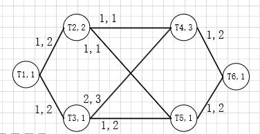

设图$G$需要循环$X=10$次。

节点上面的数字表示节点的运行时间，边上的数字前一个表示在Cache上的运行时间，后一个表示在DRAM上的运行时间。

## 输出

* 图$G$循环$X$次所需要的总时间$C$ 

## 流程

## 细节

**定义1（周期Period）：**图$G$中节点集合$V$重复一定次数并行的在一定数量的PE上执行的过程。

**定义2（发射Launch）：**多个在相同的PE上的周期组成的集合。

**定义3（周期利用率$U_p$）：**$U_{p}=\displaystyle\frac{X_{p}\times \displaystyle\sum_{T_{i}\in V}c_{i}}{h\times C_p}$，其中$X_p$表示每个周期图循环的次数，$h$表示周期需要的PE个数，$C_p$表示周期的最大时间消耗，$c_{i}$表示任务节点$T_{i}$的执行时间。

**定义4（重定时Retiming）：**对图$G=(V,E,P,R)$，重定时$R$是将节点$T_i$与一个非负整数$R(i)$映射起来，初始$R(i)=0$。一旦节点$T_i$需要进行一次重定时，则$R(i)=R(i)+1$，同时一个周期的操作$T_i$被重新分配到前序之中。

**定义5（上、下取整运算）：**对数字$a$，定义$\lfloor a\rfloor$为小于等于$a$的最大整数，定义$\lceil a\rceil$为大于等于$a$的最大整数。

**公式1（ 当$T_j$在$T_i$后面，根据$T_j$计算$T_i$的Retiming值）：**$R(i)\leftarrow MIN(R(i), \lfloor \displaystyle\frac{s_j + R(j) \times C_p-d_i -c_{i,j}}{C_p}\rfloor)$，其中$s_j$为任务节点$T_j$的开始时间，$C_p$表示周期的最大时间消耗，$d_{i}$为任务节点$T_i$的结束时间，$c_{i,j}$表示中间处理结果$I_{i,j}$的传输时间，$R(i),R(j)$分别是$T_i$和$T_j$的Retiming值。

### 1. 判断是否需要采取进行重定时策略

设$C_{b}$是按照BaseLine的调度策略所需要花费的总时间、$C_{e}$是利用重定时技术的估计时间。

若$C_{b}\lt C_{e}$，则按照BaseLine的调度策略，否则使用重定时策略。

#### BaseLine策略

尽量保证按照图原有的结构。相同拓扑序列的任务节点依次按PE的顺序放置在每个PE上，任务节点$T_j$的开始时间$s_j\leftarrow max_{I_{i,j}\in E}(d_i + c_{i,j})$，当拓扑序不同时，任务节点从编号为0的PE开始，依次按顺序放置。

> 先看拓扑序为1的节点，只有$T_1$。将$T_1$放在PE0上，得到$s^1_0=0,d^1_0=1$。
>
> 再看拓扑序为2的节点，有$T_2, T_3$，先放置$T_2$节点，将$T_2$按照图结构放置在PE0上。
>
> 计算$T_2$的开始时间，$T_2$与$T_1$之间的任务传输量$I_{1,2}$为1，刚好足够PE0上的Cache0的大小1，所以将$I_{1,2}$放在Cache0上，他们的传输时间是$c_{1,2}=1$，所以$s_2=d_1 + c_{1,2}=2$。
>
> 放置$T_3$节点，将其放置在PE1上。
>
> 计算$T_3$的开始时间，$T_3$与$T_1$之间的任务传输量$I_{1,3}$为1，刚好足够PE1上的Cache1的大小1，所以将$I_{1,3}$放在Cache1上，他们的传输时间是$c_{1,3}=1$，所以$s_3=d_1 + c_{1,3}=2$。
>
> 放置$T_4$节点，将其放置在PE0上。
>
> 计算$T_4$的开始时间，$T_4$有2个前继节点$T_2,T_3$，因为$T_2$的执行时间长于$T_3$，优先考虑$I_{2,4}$，将其放置在Cache0上，传输时间$c_{2,4}=1$，再看$T_3$，$I_{3,4}$也需要放置再PE0上，但因为$I_{2,4}$已经占据了，所以$I_{3,4}$被放置到DRAM中，传输时间$c_{2,3}=2$。所以$T_4$的开始时间$s_4=max(d_2 + c_{2,4}, d_3 + c_{3,4})=max(4 + 1, 3 + 2)=5$。
>
> 同理排列出$T_5,T_6$的位置，得到第一个周期的排列，一个周期的时间为$C_p=10$。
>
> PE3和PE4上的排列与PE0和PE1上的排列相同，所以总共运行10次，PE0和PE1上共需要运行5次，PE3和PE4上共需要运行5次，总共耗时为$C_b=5\times C_p=50$

#### 重定时估计策略

**生成周期排列**

在步骤三中，设置$X_{limited}\leftarrow1$，$h\leftarrow P$，得出一个周期的排列及周期耗时$C_p$。

> 将任务节点集合按照执行实际长短进行排序，$T_4,T_2,T_1,\ldots, T_6$。
>
> 因为每个PE上的任务时间和都为0，所以将$T_4$放到第一个PE，即PE0上。
>
> 因为PE1、PE2、PE3上的饿任务时间和都为0，将$T_2$放到PE1上，同理将$T_1$、$T_3$放到PE2和PE3上。
>
> 此时PE0的总耗时为$C_{p_0}=3$，PE1的总耗时为$C_{p_1}=2$，PE2的总耗时为$C_{p_2}=1$，PE3的总耗时为$C_{p_3}=1$。
>
> $T_5$选择总耗时最短的一个PE，即PE2，放在它上面。
>
> $T_6$同理放到PE3上面。
>
> 此时PE0的总耗时为$C_{p_0}=3$，PE1的总耗时为$C_{p_1}=2$，PE2的总耗时为$C_{p_2}=2$，PE3的总耗时为$C_{p_3}=2$。
>
> 完成一个周期的排列，周期耗时$C_p=max(C_{p_i})=3$

**计算Retiming值**

按照拓扑序从大到小的顺序，依次更新任务节点的Retiming值。

对任务节点$T_j$，更新其前继节点$T_i$的Retiming值。

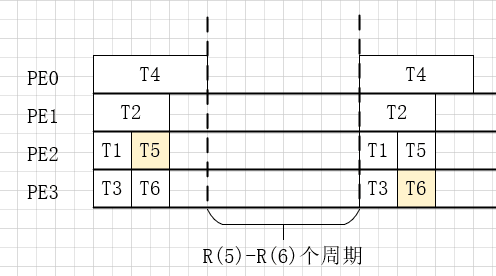

前继节点$T_i$需要满足的条件是：$d_i + R(i) \times C_p + c_{i,j}\le s_j + R(j)\times C_p$

$T_i$和$T_j$的中间处理结果$I_{i,j}$的存储优先考虑放在Cache中，若Cache中放不下，则放在DRAM中。

根据**公式1**计算$T_i$的Retiming值$R(i)$。

> 从拓扑序最大的节点开始更新Retiming值，令所有的$R(i)\leftarrow0$ ，$T_6$的前继节点是$T_5$和$T_4$。
>
> 对$T_4$来说，$d_4 + R(4)\times  C_p + c_{4,6}\le s_6 + R(6)\times C_p$，因为此时$T_6$所在的PE3上面的Cache3是空闲的，所以$I_{4,6}$可以放在Cache3上，$c_{4,6}=1$，所以得到$R(4)=MIN(R(4), \lfloor \displaystyle\frac{s_6 + R(6) \times C_p-d_4 -c_{4,6}}{C_p}\rfloor)=MIN(0, \lfloor \displaystyle\frac{1 + 0 \times 3-3 -1}{3}\rfloor)=MIN(0,-1)=-1$
>
> 因为$I_{5,6}$也需要放置在Cache3上，但Cache3已经放了$I_{4,6}$，它的传输时间与$I_{5,6}$有相交，所以将$I_{5,6}$放到DRAM中，$c_{5,6}=2$
>
> 同理，$R(5)=MIN(R(5), \lfloor \displaystyle\frac{s_6 + R(6) \times C_p-d_5 -c_{5,6}}{C_p}\rfloor)=MIN(R(5),\lfloor \displaystyle\frac{1 + 0 \times 3-2 -2}{3}\rfloor)=-1$
>
> 接下来看$T_4$的前继节点$T_3$和$T_2$，先看$T_3$。
>
> 因为$I_{3,4}$可以放在$T_4$在的PE0的Cache上，$c_{3,4}=2$
>
> $R(3)=MIN(R(3), \lfloor \displaystyle\frac{s_4 + R(4) \times C_p-d_3 -c_{3,4}}{C_p}\rfloor)=MIN(0, \lfloor \displaystyle\frac{0 -1 \times 3-1 -1}{3}\rfloor)=-2$
>
> 再看$T_2$，因为$I_{3,4}$已经将$I_{2,4}$所需的时间段的Cache资源占用，所以$I_{2,4}$需要放到DARM中，$c_{2,4}=1$
>
> $R(2)=MIN(R(2), \lfloor \displaystyle\frac{s_4 + R(4) \times C_p-d_2 -c_{2,4}}{C_p}\rfloor)=MIN(0, \lfloor \displaystyle\frac{0 -1 \times 3-2 -1}{3}\rfloor)=-2$
>
> 接下来看$T_5$的前继节点$T_3$和$T_2$，先看$T_3$。
>
> 因为$I_{3,5}$可以放在$T_5$在的PE2的Cache上，$c_{3,5}=1$
>
> $R(3)=MIN(R(3), \lfloor \displaystyle\frac{s_5 + R(5) \times C_p-d_3 -c_{3,5}}{C_p}\rfloor)=MIN(-2, \lfloor \displaystyle\frac{1 -1 \times 3-1 -1}{3}\rfloor)=-2$
>
> 再看$T_2$，因为$I_{3,5}$已经将$I_{2,5}$所需的时间段的Cache资源占用，所以$I_{2,5}$需要放到DARM中，$c_{2,5}=1$
>
> $R(2)=MIN(R(2), \lfloor \displaystyle\frac{s_5 + R(5) \times C_p-d_2 -c_{2,5}}{C_p}\rfloor)=MIN(-2, \lfloor \displaystyle\frac{1 -1 \times 3-2 -1}{3}\rfloor)=-2$
>
> 接下来看$T_2$的前继节点$T_1$，$I_{1,2}$可以放在$T_2$的PE1的Cache上，所以$c_{1,2}=1$
>
> $R(1)=MIN(R(1), \lfloor \displaystyle\frac{s_2 + R(2) \times C_p-d_1 -c_{1,2}}{C_p}\rfloor)=MIN(0, \lfloor \displaystyle\frac{0 -2 \times 3-1 -1}{3}\rfloor)=-3$
>
> 接下来看$T_3$的前继节点$T_1$，$I_{1,3}$可以放在$T_3$的PE3的Cache上，所以$c_{1,3}=1$
>
> $R(1)=MIN(R(1), \lfloor \displaystyle\frac{s_3 + R(3) \times C_p-d_1 -c_{1,3}}{C_p}\rfloor)=MIN(-3, \lfloor \displaystyle\frac{0 -2 \times 3-1 -1}{3}\rfloor)=-3$

**计算总时间$C_e$**

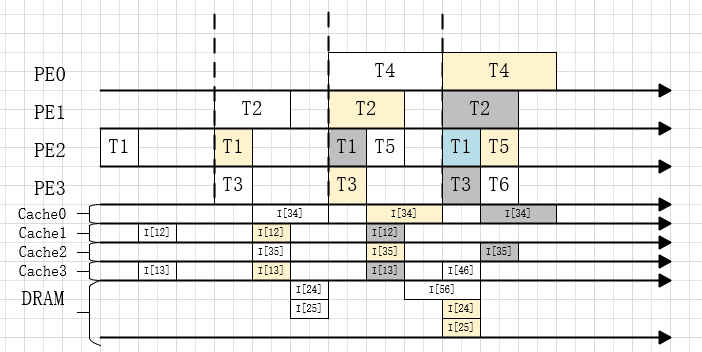

计算前序时间：$C_{prelogue}\leftarrow MAX_{T_i\in V}(|R(i)|)\times C_p$

计算总时间：$C_{e}\leftarrow C_{prelogue}+X\times C_{p}$

> 计算前序时间：$C_{prelogue}\leftarrow MAX_{T_i\in V}(|R(i)|)\times C_p=3\times 3=9$
>
> 计算总时间：$C_{e}\leftarrow C_{prelogue}+X\times C_{p}=9 + 3\times 10=39$
>
> 所以$C_e\lt C_b$，可以进行重定时。

### 2. 计算每次发射的PE数$h$、图的执行次数$X_L$

首先利用多发射技术，将$X$轮图$G$的运行均摊到$H$次发射之上，以达到更高效的并行性。

我们将$P$个PE分成尽可能平均得分成$H$组，将图$G$的$X$次循环也尽可能平均的分到每组上面，最终使得总时间$C$最短。

我们称每组PE上的$X_L$次图$G$的排列为一次发射，那么$H$组PE就有$H$次发射。

我们取图$G$的最大并发度$h_G$为每组中PE的个数，那么$H=\lceil P/h\rceil$。

因为$h_G$不一定能够整除$P$，所以需要进行分类讨论，

**若$h_G$能整除$P$，即$P\% h_G=0$**，则

- $h=h_G$
- $X_{L}=\lceil X/H\rceil$

**若$h_G$不能整除$P$，即$P\% h_G\not=0$**，则将前$H-1$次发射和最后一次发射区分出来，前$H-1$次发射的排列都是相同的，最后一次是不同的排列方案。

* 在前$H-1$次发射，每次都是$h_G$个PE；最后一次发射，因为PE个数不够$h_G$个，所以只用$P\%h_G$个。

* 我们认为前$H-1$次发射都是$X_x$次图G的排列，最后一次是$X_y$次图$G$的排列。所以$(X_x,X_y)$需要满足$X=(H-1)\times X_x + X_y\quad 公式2$。

  因为在已经知道调度方案的前序时间$C_{prelogue}$和周期最大时间$C_p$后，可以在$O(1)$的时间内计算出执行$X$次图$G$的总时间$C=C_{prelogue} + X\times C_p$

  所以此时的总时间取决于两种排列方案的最大值，设前$H-1$次发射的排列的前序时间是$C^x_{prelogue}$，周期最大时间消耗是$C^x_p$；最后一次发射的排列的前序时间是$C^y_{prelogue}$，周期最大时间消耗是$C^y_p$，则总时间为$C=MAX(C^x_{prelogue} + X_x\times C^x_p,C^y_{prelogue} + X_y\times C^y_p)\quad 公式3$。

  将式2带入式3，得到关于$X_x$的函数：$C(X_x)=MAX(C^x_{prelogue} + X_x\times C^x_p,C^y_{prelogue} + (X-(H-1)\times X_x)\times C^y_p)\quad 0\le X_x\le X$。

  注意到$MAX​$函数两边都是一次函数，且一增一减，所以当两个函数直线相交是$C(X_x)​$取到最小值。
  $$
  C^x_{prelogue} + X_x\times C^x_p=C^y_{prelogue} + (X-(H-1)\times X_x)\times C^y_p
  \\
  \Rightarrow X_x=\lfloor\displaystyle\frac{C^x_p+(H-1)\times C^y_p}{C^y_{prelogue}+X\times C^y_p - C^x_{prelogue}}\rfloor\quad 公式4
  \\
  \Rightarrow X_y=X-(H-1)\times X_x
  $$

> $P=4$，根据图的结构知道$h_G=2$
>
> 所以$P\%h_G=0$，
>
> 则$h=2,H=2,X_L=\lceil X/H\rceil=\lceil 10 / 2\rceil =5$

> 因为例子中刚好是整除的情况，若$P=5$，此时不整除，那么$h=2,H=3$。这一步需要等到后面的步骤都完成后才能进行计算，此处举例假设已经完成。
>
> 若前$H-1$次发射的前序时间是$C^x_{prelogue}=6$，周期时间是$C^x_p=3$，最后一次发射的前序时间是$C^y_{prelogue}=8$，周期时间是$C^y_p=4$ 。
>
> 设变量$X_x,X_y$，满足公式2：$10=2\times X_x + X_y$，
>
> 总时间函数为：$C=MAX(C^x_{prelogue} + X_x\times C^x_p,C^y_{prelogue} + X_y\times C^y_p)=MAX(6 + X_x\times 3,8+X_y\times 4)$
>
> 即$C(X_x)=MAX(6+X_x\times 3,48-8\times X_x)$
>
> 故将里面两个函数相等得到最优解$X_x=3,X_y=4$

### 3. 生成周期的任务排列

对于一个包含$h$个PE的周期，不同的任务排列对最终的结果有着很大的影响。

若直接按照顺序把所有任务节点依次排列在2个PE上，可以一个周期的时长是6个单位时间，利用率是75%。通过观察可以发现，因为图G中有一个长节点$T_4$和一个较长节点$T_2$，它们的运行时间远大于其他的运行节点，因为顺序的原因，它们被排列在了同一个PE上，所以导致了第一个PE在$T_5$之后就呈空闲状态。

为了避免这样因顺序而导致分配不均衡，本算法从任务节点的具体执行时间出发，依据执行时间的长短来对任务节点进行排列，具体是采取贪心的策略对任务节点进行排列。这个问题可以抽象成最小化最大值问题，若定义$C_{p_i}$为编号为$p_i$的PE上的所有任务时间之和，则目标为最小化$max(C_{p_i})$。

算法的步骤是

1. 对所有的节点按照执行时间大小从大到小排序
2. 每次将节点放在当前所有PE中$C_{p_i}$最小的PE上，并更新$C_{p_i}$。

$X_{p}$的值依据$U_{p}$来确定。每按照上述算法排列一次图$G$，$X_{p}\leftarrow X_{p}+1$，并重新计算一下当前的利用率$U_p$，若$U_p\ge U_{limited}$，则停止排列；若$X_{p}\ge X_{limited}$，则停止排列，选择之前计算得到的最大的$U_{p}$。

> **Input**
>
> $A\;set\;tasks\;\{T_1,\ldots,T_n\}\in V$
>
> $P\;homogeneous\;PEs$
>
> $h\;of\;tasks\;that\;are\;concureently\;execeuted\;within\;same\;layer$
>
> $the\;threshold\;PE's\;utilization\;ratio\;U_{limited}$
>
> $the\;max\;repeat\;times\;X_{limited}\;of\;tasks\;in\;same\;iteration$
>
> **Output**
>
> $An\;initial\;schedule\;with\;X_{p}\;repeat\;times\;tasks$
>
> **Content**
>
> $InitArrange()$
>
> $Sort(V) \;first\; by \;c_i\;,second\; by\; tp_{i}$
>
> $While\; U_{p}\lt U_{limited}\;and\;X_{p}\lt X_{limited}:$
>
> $\quad For\;each \;task\;T_j\in V:$
>
> $\quad\quad Assign\;T_j\;to \;a\;PE\;i\;with\;minimum\;C_{p_i}$
>
> $\quad\quad C_{p_i}\leftarrow C_{p_i}+c_j$
>
> $\quad X_{p}\leftarrow X_{p}+1$
>
> $\quad ReCalculate\;U_p$
>
> $If\;X_{p}=X_{limited}:$
>
> $\quad Choose\;X_{p}\;with\;max\;U_{p}$
>
> $Rearrange\;X_{p}\;times\;tasks\;with\;same\;strategy$

时间复杂度：$O(X_{p}\times n\times log\;h)$

> 根据前一个步骤知道，共有2次发射，每次发射需要2个PE，故我们先看第一次发射的，第二次发射与第一次发射相同。
>
> 先将任务节点按照时间大小进行排序，$T_4,T_2,T_1,T_3,T_5,T_6$ 。
>
> 设置$U_{limited}=80\%,X_{limited}=5$
>
> 令$C_{p_i}\leftarrow 0$，加入优先队列$Q$，$X_p\leftarrow 0$。
>
> 队列状态$C_{p_0}=0,C_{p_1}=0$
>
> 从优先队列取出队首元素$C_{p_0}$，$T^1_4$放到PE0上，更新$C_{p_0}\leftarrow C_{p_0} + c^1_4=0 + 3=3$，将$C_{p_0}$加入队列
>
> 队列状态$C_{p_1}=0,C_{p_0}=3$
>
> 从优先队列取出队首元素$C_{p_1}$，$T^1_2$放到PE1上，更新$C_{p_1}\leftarrow C_{p_1} + c^1_2=0 + 2=2$，将$C_{p_1}$加入队列
>
> 队列状态$C_{p_1}=2,C_{p_0}=3$
>
> 从优先队列取出队首元素$C_{p_1}$，$T^1_1$放到PE1上，更新$C_{p_1}\leftarrow C_{p_1} + c^1_1=2 + 1=3$，将$C_{p_1}$加入队列
>
> 队列状态$C_{p_0}=3,C_{p_1}=3$
>
> 从优先队列取出队首元素$C_{p_0}$，$T^1_3$放到PE0上，更新$C_{p_0}\leftarrow C_{p_0} + c^1_3=3 + 1=4$，将$C_{p_0}$加入队列
>
> 队列状态$C_{p_1}=3,C_{p_0}=4$
>
> 从优先队列取出队首元素$C_{p_1}$，$T^1_5$放到PE1上，更新$C_{p_1}\leftarrow C_{p_1} + c^1_5=3 + 1=4$，将$C_{p_0}$加入队列
>
> 队列状态$C_{p_0}=4,C_{p_1}=4$
>
> 从优先队列取出队首元素$C_{p_0}$，$T^1_6$放到PE0上，更新$C_{p_0}\leftarrow C_{p_0} + c^1_6=4+ 1=5$，将$C_{p_0}$加入队列
>
> 队列状态$C_{p_1}=4,C_{p_1}=5$
>
> $X_p\leftarrow X_p + 1=0 + 1=1$
>
> $C_p\leftarrow MAX(C_{p_i})=5$
>
> 计算当前利用率：$U_{p}=\displaystyle\frac{X_{p}\times \displaystyle\sum_{T_{i}\in V}c_{i}}{h\times C_p}=\displaystyle \frac{1\times 9}{2\times 5}=90\%$
>
> 利用率$U_p$大于利用率下限$U_{limited}$，算法结束，返回当前排列结果。

### 4. 确定周期内每个任务节点的最终位置

基于前一个步骤生成的周期的初始排列，根据任务之间的依赖关系进一步调整任务节点的最终位置。

#### 根据确定位置的任务节点$T_j$移动前继任务节点$T_i$的位置

若任务节点$T_j$的位置已经固定，则根据$T_j$的位置来确定前继节点的位置。

##### 若$T_i$的位置还未固定

定义$dis_{i,j}$根据周期的排列$T_i$与$T_j$之间的实际距离，若$T_i$在$T_j$后面则$dis_{i,j}$为0。

* 若$dis_{i,j}\ge c_{i,j}$，对$T_i$前后未固定位置的所有任务节点构成集合$V_{move}$，通过**重排移动**这些任务节点让$T_i$与$T_j$的实际距离$dis_{i,j}$尽可能的接近$c_{i,j}$。重排移动可以看作是一个装箱问题，可以采用动态规划或者贪心的策略，把$V_{move}/\{T_i\}$中的任务节点的时间认为是物品的大小，$d_{i,j}-c_{i,j}$的值为箱子的大小，则未被选择的任务节点认为是放置在$T_i$和$T_j$之间的任务节点。标记$T_i$的位置已经固定。

  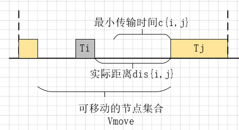

* 若$dis_{i,j}\lt c_{i,j}$，将$T_i$放置在可移动的区间$[l_i,r_i]$的末尾，即$d_i\leftarrow r_i$，并标记$T_i$的位置已经固定，根据**公式1**计算$T_i$的Retiming值。

  对于$T_i$在$T_j$前面，

  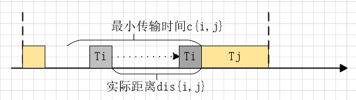

  对于$T_i$在$T_j$后面，

  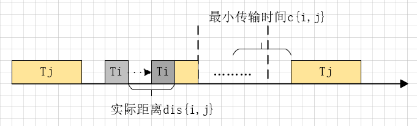

##### 若$T_i$的位置已经固定

根据**公式1**更新$T_i$的Retiming值。

> **Input**
>
> $Node \;T^l_i\;and\;T^l_j$
>
> $Moving\;Interval\;[l^l_i,r^l_i]$
>
> **Output**
>
> $Updated\;Node\;T^l_i\;and\;[l^l_i,r^l_i]$
>
> **Content**
>
> $UpdateNode():$
>
> $If\;T^l_i;isn't\;certained:$
>
> $\quad dis^l_{i,j}\leftarrow MAX(0,s^l_j-d^l_i)$
>
> $\quad If\;dis^l_{i,j} \le c^l_{i,j}:$
>
> $\quad \quad Using \;dynamic\;or\;greedy\;algorithm\;get\;unselected\;node\;set\;V_{unselected} $
>
> $\quad\quad d^l_i\leftarrow r^l_i-SUM_{T_k\in V_{unselected}}(c_k)$
>
> $\quad\quad R(i)\leftarrow MIN(R(i),R(j))$
>
> $\quad Else:$
>
> $\quad \quad d^l_i\leftarrow r^l_i$
>
> $\quad\quad R(i)\leftarrow MIN(R(i), \lfloor \displaystyle\frac{s^l_j + R(j) \times C_p-d^l_i -c^l_{i,j}}{C_p}\rfloor)$
>
> $\quad Set\;T^l_i\;certained$
>
> $Else:$
>
> $\quad R(i)\leftarrow MIN(R(i), \lfloor \displaystyle\frac{s^l_j + R(j) \times C_p-d^l_i -c^l_{i,j}}{C_p}\rfloor)$

时间复杂度分析：$O(n)$

#### 按照顺序依次调整任务节点

前一步中节点依次调整的顺序不同，对最后的结果也会产生不同的影响。同时考虑到每次移动节点也需要一定的代价，所以为了减少移动节点产生的代价，本步骤将确定一个任务节点的调整顺序来依次确定每个节点在周期内的位置。

根据之前对任务节点耗时的分析，关键节点在位置排列的时候会对其他节点的Retiming值产生较大的影响。故策略是从关键节点开始，按照拓扑序大小从大到小向前“扩散”，依次调整前继节点的位置及Retiming值。

每次“扩散”时，都将标记已确定位置的节点和更新了Retiming值的节点。当一次扩散结束后，再从未确定位置的节点中选择新的关键节点继续开始扩散，直到所有节点都被确定了位置。

当扩散完成后，从所有更新过Retiming值的节点中选择拓扑序最大的节点，依次向前更新其前继节点的Retiming值。

图（a）中选择了关键节点$T_4$作为扩散的起始节点。从图（a）到图（c）展示了第一次的扩散过程。图（d）从未访问过的节点$T_5,T_6$中重新选择了关键节点$T_6$作为新的扩散起始节点。图（e）从$T_6$扩散至$T_5,T_4$，因为$T_4$已经被访问过，所以只需要它的位置不需要再进行改变。若$T_4$和$T_6$的位置之间的距离不满足边$I_{4,6}$的所需要的时间消耗的长度，则需要对$T_4$做重定时操作。当$R(4)$的值发生改变后，与其相连的前继节点对应的$R(i)$也需要更新。为了避免重复更新，在$R(4)$更新后，仅仅标记$T_4$节点，等待所有的节点都访问完成后，再从拓扑序最大的标记节点开始向前更新。

>**Input**
>
>$An\;initial\;schedule\;with\;X_{p}\;repeat\;times\;tasks\;\{T^l_1,\ldots,T^l_n\}$
>
>$Moving\;Interval\;[l^l_i,r^l_i]$
>
>**Output**
>
>$A\;schedule\;after\;adjusting$
>
>**Content**
>
>$SpreadFromKeyNodeSet():$
>
>$Q\leftarrow \emptyset$
>
>$do\; \{$
>
>$\quad Get\;keynode\;set\;V_{keynode}\;from\;V_{unchecked}$
>
>$\quad For\;each\;task\;T^l_i\in V_{keynode}:$
>
>$\quad \quad s^l_i\leftarrow l^l_i$
>
>$\quad\quad Set\;T^l_i\;certained$
>
>$\quad \quad ENQUEUE(Q, T^l_i) $
>
>$\quad While\; Q\neq \emptyset:$
>
>$\quad \quad T^l_j\leftarrow DEQUEUE(Q)$
>
>$\quad\quad For\;each\;edge\;I^l_{ij}\in E$
>
>$\quad \quad \quad UpdateNode(T^l_i, T^l_j)$
>
>$\quad\quad\quad ENQUEUE(Q,T^l_i)$
>
>$\}\;While(V_{unchecked}\neq \emptyset);$

时间复杂度：$O(X_{p}\times m )$

> 定义关键性变量$\alpha =0.8$，队列$Q$
>
> 令所有的$R(i)\leftarrow 0$
>
> 将所有节点加入未检查节点集合$V_{unchecked}$，从中取出关键节点集合$V_{keynode}=\{T^1_4\}$ （$T_2$不是关键节点是因为$c_2\times \alpha\lt MAX(c_i)$）
>
> 将节点$T^1_4$放到当前区间最前面，$s^1_4\leftarrow 0$ ，标记$T^1_4$确定，将节点$T^1_4$加入队列
>
> 
>
> 取出队首元素$T^1_4$，考虑$T^1_4$的前继节点，按执行时间长短，先是$T^1_2$ 。
>
> $I_{2,4}$在Cache上的执行时间是$c^1_{2,4}=1$。任务节点$T^1_2$不在$T^1_4$的前面，所以$dis_{2,4}=0$ 。考虑前一个周期内的$T^1_2$，将其移动到最接近的时间。
>
> 移动前：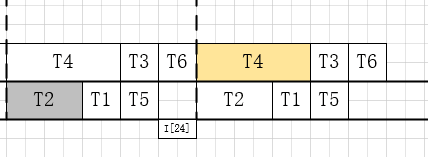
>
> 移动后：
>
> 更新$T^1_2,T^1_5,T^1_1$的开始时间和结束时间：$s^1_1\leftarrow 0,d^1_1\leftarrow 1,s^1_5\leftarrow 1,d^1_5\leftarrow 2,s^1_2\leftarrow 2,d^1_2\leftarrow 4$
>
> 更新$R(2)\leftarrow MIN(R(2), \lfloor \displaystyle\frac{s^1_4 + R(4) \times C_p-d^1_2 -c^1_{2,4}}{C_p}\rfloor)=MIN(0, \lfloor \displaystyle\frac{0 + 0 \times 5-4 -1}{5}\rfloor)=-1$
>
> 标记$T^1_2$为确定节点，从$V_{unchecked}$中去掉$T^1_2$，将$T^1_2$加入队列
>
> 再看$T^1_4$的前继节点$T^1_3$，
>
> $I_{3,4}$在Cache上的执行时间是$c^1_{3,4}=2$。任务节点$T^1_3$不在$T^1_4$的前面，所以$dis_{3,4}=0$ 。因为前一个周期的$T^1_3$不满足$c_{3,4}$，所以看前两个周期的$T^1_3$，将其移动到最接近的时间。
>
> 移动前：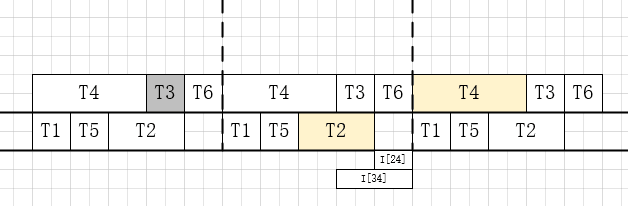
>
> 移动后：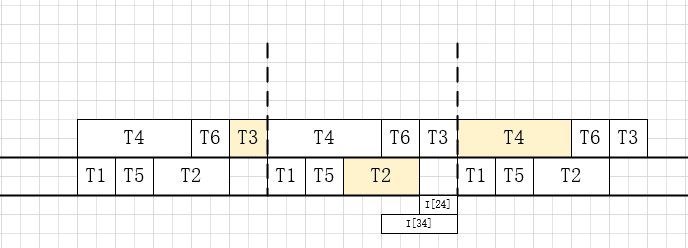
>
> 更新$T^1_3,T^1_6$的开始时间和结束时间：$s^1_6\leftarrow 3,d^1_6\leftarrow 4,s^1_3\leftarrow 4,d^1_3\leftarrow 5$
>
> 更新$R(3)\leftarrow MIN(R(3), \lfloor \displaystyle\frac{s^1_4 + R(4) \times C_p-d^1_3 -c^1_{3,4}}{C_p}\rfloor)=MIN(0, \lfloor \displaystyle\frac{0 + 0 \times 5-5 -1}{5}\rfloor)=-2$
>
> 标记$T^1_3$为确定节点，从$V_{unchecked}$中去掉$T^1_3$，将$T^1_3$加入队列
>
> 
>
> 取出队首元素$T^1_2$，考虑$T^1_2$的前继节点$T^1_1$
>
> $I_{1,2}$在Cache上的执行时间是$c^1_{1,2}=1$。任务节点$T^1_1$在$T^1_2$的前面，所以$dis_{1,2}=1=c^1_{1,2}$ 。所以$T^1_1$不需要移动，$R(1)\leftarrow MIN(R(1),R(2))=-1$
>
> 标记$T^1_1$为确定节点，从$V_{unchecked}$中去掉$T^1_1$，将$T^1_1$加入队列
>
> 
>
> 取出队首元素$T^1_3$，考虑$T^1_3$的前继节点$T^1_1$
>
> 因为$T^1_1$已经是确定的节点了，且$c^1_{1,3}=1$，所以直接更新$R(1)\leftarrow MIN(R(1), \lfloor \displaystyle\frac{s^1_3 + R(3) \times C_p-d^1_1 -c^1_{1,3}}{C_p}\rfloor)=MIN(-1, \lfloor \displaystyle\frac{4 - 2 \times 5-1 -1}{5}\rfloor)=-2$
>
> 标记$T^1_1$为Retiming更新点
>
> 
>
> 取出队首元素$T^1_1$，因为没有前继节点。循环结束，重新选取关键节点集合，$V_{keynode}=\{T^1_6\}$
>
> 因为排列在$T^1_6$前后的节点都有已经确定的，所以将其放到当前能活动区间最前面（此时就是不动）
>
> 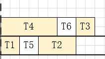
>
> 标记$T^1_6$确定，将其加入队列$Q$
>
> 
>
> 取出队首元素$T^1_6$，考虑其前继节点$T^1_4$，因为它已经确定了，$c^1_{4,6}=1$，直接更新$R(4)\leftarrow MIN(R(4), \lfloor \displaystyle\frac{s^1_6 + R(6) \times C_p-d^1_4 -c^1_{4,6}}{C_p}\rfloor)=MIN(0, \lfloor \displaystyle\frac{3 - 0 \times 5- 3-1}{5}\rfloor)=-1$
>
> 标记$T^1_4$为Retiming更新点
>
> 考虑前继节点$T^1_5$，$c^1_{5,6}=1$，且$T^1_5$在$T^1_6$前面，$dis_{5,6}=1=c^1_{5,6}$ ，$T^1_{5,6}$不需要移动。
>
> $R(5)\leftarrow MIN(R(5),R(6))=0$
>
> 标记$T^1_5$为确定节点，从$V_{unchecked}$中去掉$T^1_5$，将$T^1_5$加入队列
>
> 
>
> 取出队首元素$T^1_5$，考虑其两个已确定的前继节点$T^1_2,T^1_3$，计算得出不需要更新$R(2),R(3)$
>
> 
>
> 所有节点都已经确定，周期最后排列为：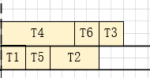
>
> Retiming更新点有$T^1_4,T^1_1$，从拓扑序值大的$T^1_4$开始向前用公式1更新Retiming值，最后得出
>
> $R(1)=-3,R(2)=-2,R(3)=-3,R(4)=-1,R(5)=0,R(6)=0$
>
> 
>
> 所有PE上的排列：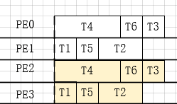

### 5. 利用动态规划来分配任务的中间传输的数据存储位置

在前面的步骤中，对中间处理结果$I_{i,j}$的传输时间$c_{i,j}$我们都是基于在SRAM的速度进行计算得到的结果，但考虑到SRAM的容量有限，我们无法将所有的中间结果都存储在SRAM中，必定有一部分的中间结果需要存储到DRAM中。

本步骤中对SRAM中溢出部分的中间处理结果，利用动态规划或贪心的思想，选择其中一部分任务放入DRAM中，更新这些任务的Retiming值。

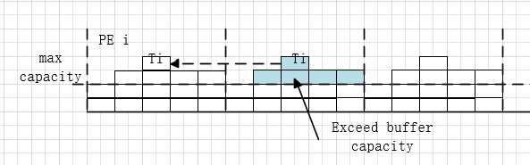

这个问题可以被抽象成一个装箱问题，对每一个溢出部分的中间处理结果集合$E_{exceed}=\{I_{i1,j1},\ldots, I_{i_k,j_k},\ldots,I_{i_s,j_s}\}$，将它们看作是物品的大小，SRAM的容量$S$看作是箱子的大小，**将$I_{i_k,j_k}$放入DRAM所产生的Retiming值的变化量$\Delta R(i)$为价值（先修改$c_{i_k,j_k}$在DRAM中的值，根据公式1计算出新的$R(i)$，得到变化量）。**设$\mathbb B[S][k]$表示规模为$(k,S)$的最优解，若第$k$个中间处理结果的大小不大于容量$S$，则那么可以将问题转移到求解规模为$(k-1, S-I_k)$的最优解；若大于，则求解规模为$(S,k-1)$的最优解。最优解的状态转移方程：
$$
\mathbb B[S][k]=
\begin{cases}
\mathbb B[S][k-1]&if\;I_{i_k,j_k}\gt S
\\
max\{\mathbb B[S][k-1],\mathbb B[S-I_{i_k,j_k}][k-1]+\Delta R(i)\} & if \;I_{i_k,j_k}\le S
\end{cases}
$$
当计算完成后，通过回溯法得到最优解$\{I_{i1,j1},\ldots, I_{i_k,j_k}\}$。

重新计算这些中间处理结果在DRAM中的传输时间$c_{i,j}$，对每个$I_{i,j}$，按照$T_j$的拓扑序大小从大到小，向前更新$T_i$的Retiming值。

> 在前一个步骤中默认把所有的中间处理结果都存在Cache中，所以现在Cache的存储情况如下，以Cache0为例：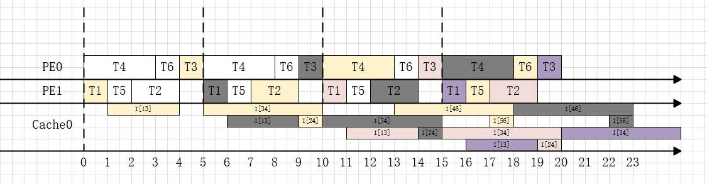
>
> 因为Cache0的最大容量为1，同时可以发现在17时刻后，Cache消耗的最大容量稳定在4，所以仅仅看稳定后的一个周期，即15时刻到20时刻。
>
> 我们根据任务传输时间段将这个时间段分为[15,16]，[16,17]，[17,18]，[18,19]，[19,20]。
>
> 依次检测每个时间段内的内存超出情况。
>
> 先看[15,16]时间段，此时稳定后得到最大容量为2，超出。所以用动态规划或贪心的方法选择留在Cache中的中间处理结果，此时根据动态规划，只存在两种状态，他们的$\Delta R(i)$均为0，可以随便选一组解。
>
> 所以将中间处理结果$I_{4,6}$留下，将$I_{3,4}$放入DRAM，标记$T_3$为Retiming更新节点。此时Cache0存储状况为：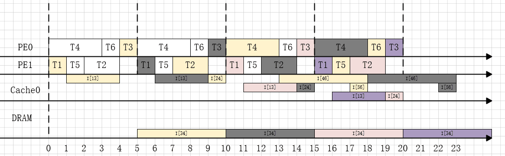
>
> 再看[16,17]时间段，需要选择的中间处理结果是$I_{4,6},I_{1,3}$，用同样的方法，选择$I_{1,3}$留下，将$I_{4,6}$留下，标记$T_1$为Retiming更新点。
>
> 同理，将$I_{5,6}$放入了DRAM。最终Cache0的存储状态为：
>
> 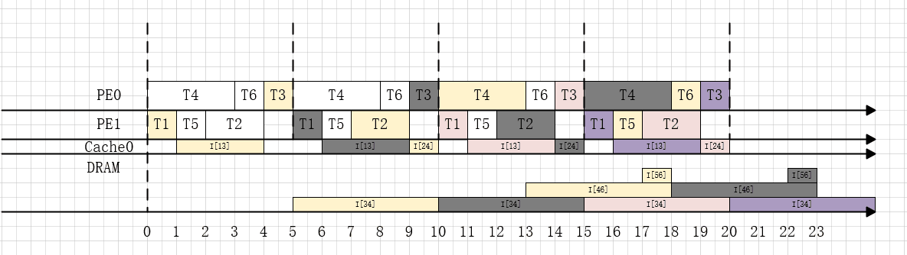
>
> 
>
> 用同样的方法，分别对Cache1做处理，得到所有的Retiming更新点。用前一步中最后的Retiming更新的方法，从拓扑序最大的节点开始更新Retiming值，得到最终所有节点的Retiming值（本例中所有节点的Retiming值均未变，即$R(1)=-3,R(2)=-2,R(3)=-3,R(4)=-1,R(5)=0,R(6)=0$）。
>
> 
>
> 第二次发射采用与第一次发射相同的排列方案，最终的排列如下：
>
> 
>
> 前序时间为：$C_{prelogue}=MAX_{T_i\in V}(|R(i))\times C_p=3\times 5 = 15$
>
> 总时间为：$C=C_{prelogue} + X_L\times C_p=15 + 5\times 5=40\lt C_b$